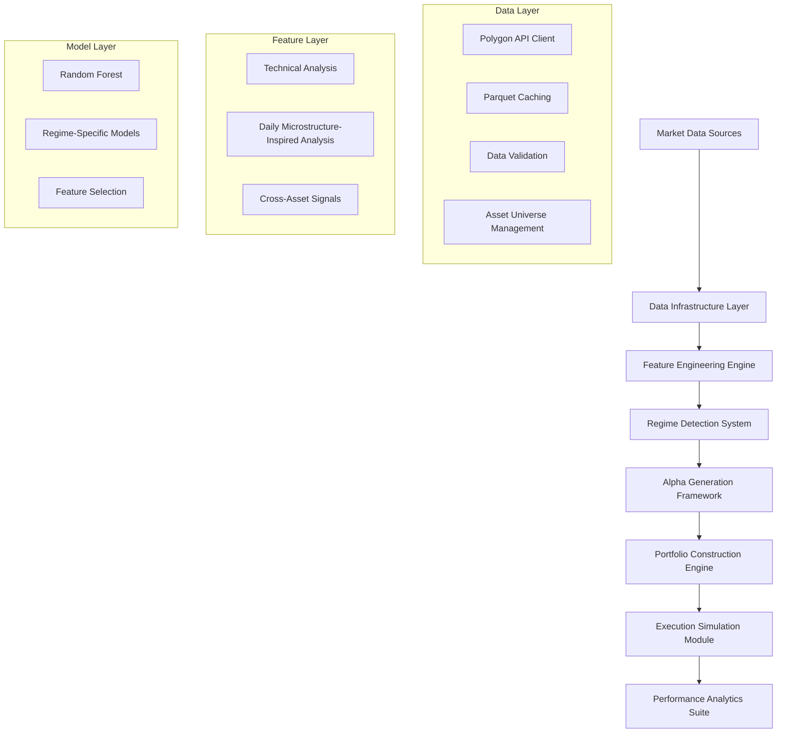

# System Architecture

**IMPORTANT: All empirical analysis in this project is conducted at daily frequency using daily OHLCV bars from Polygon.io. No intraday, tick, or order-book data is used in the current experiment.**

## Overview

The Cross-Asset Alpha Engine employs a modular, scalable architecture designed for both research and production deployment. The system separates concerns across data ingestion, feature engineering, regime detection, alpha generation, and portfolio construction. Execution is modeled at daily close-to-close with simple costs, not an intraday microstructure model.

## High-Level Architecture



## Component Architecture

### 1. Data Infrastructure Layer

#### Polygon API Client
```python
class PolygonClient:
    """Professional-grade API client with retry logic and rate limiting."""
    
    def __init__(self, api_key: str, base_delay: float = 0.5):
        self.api_key = api_key
        self.base_delay = base_delay
        self.session = requests.Session()
    
    def get_daily_bars(self, symbol: str, start_date: date, end_date: date):
        """Fetch daily OHLCV data with automatic retry."""
        url = f"{self.base_url}/v2/aggs/ticker/{symbol}/range/1/day/{start_date}/{end_date}"
        
        for attempt in range(self.max_retries):
            try:
                response = self.session.get(url, headers=self.headers)
                if response.status_code == 200:
                    return response.json()
                elif response.status_code == 429:  # Rate limited
                    time.sleep(self.base_delay * (2 ** attempt))
                    continue
            except Exception as e:
                if attempt == self.max_retries - 1:
                    raise e
                time.sleep(self.base_delay * (2 ** attempt))
```

#### Data Caching System
```python
class DataCache:
    """Efficient parquet-based caching system."""
    
    def __init__(self, cache_dir: str = "cache"):
        self.cache_dir = Path(cache_dir)
        self.cache_dir.mkdir(exist_ok=True)
    
    def save_data(self, data: pd.DataFrame, symbol: str, start_date: date, end_date: date):
        """Save data with metadata for efficient retrieval."""
        cache_key = self._generate_cache_key(symbol, start_date, end_date)
        cache_path = self.cache_dir / f"{cache_key}.parquet"
        
        # Save with compression
        data.to_parquet(cache_path, compression='snappy', index=False)
        
        # Save metadata
        metadata = {
            "symbol": symbol,
            "start_date": start_date.isoformat(),
            "end_date": end_date.isoformat(),
            "cached_at": datetime.now().isoformat(),
            "records": len(data)
        }
        
        with open(cache_path.with_suffix('.metadata.json'), 'w') as f:
            json.dump(metadata, f)
```

### 2. Feature Engineering Engine

#### Technical Analysis Module
```python
class TechnicalFeatureEngine:
    """Comprehensive technical analysis feature generation."""
    
    def __init__(self, config: TechnicalConfig):
        self.config = config
    
    def generate_momentum_features(self, data: pd.DataFrame) -> pd.DataFrame:
        """Generate multi-timeframe momentum indicators."""
        features = data.copy()
        
        # Multi-horizon returns
        for period in [1, 5, 20, 60]:
            features[f'returns_{period}d'] = data['close'].pct_change(period)
        
        # Momentum acceleration
        features['momentum_accel'] = (
            features['returns_5d'] - features['returns_20d']
        )
        
        # Relative strength
        features['relative_strength'] = (
            features['returns_20d'] / features['returns_60d']
        )
        
        return features
    
    def generate_volatility_features(self, data: pd.DataFrame) -> pd.DataFrame:
        """Generate volatility-based features."""
        features = data.copy()
        returns = data['close'].pct_change()
        
        # Multi-horizon volatility
        for window in [5, 20, 60]:
            features[f'volatility_{window}d'] = (
                returns.rolling(window).std() * np.sqrt(252)
            )
        
        # Volatility ratios
        features['vol_ratio_5_20'] = (
            features['volatility_5d'] / features['volatility_20d']
        )
        
        # Volatility persistence
        features['vol_persistence'] = (
            features['volatility_5d'].rolling(5).mean()
        )
        
        return features
```

#### Daily Microstructure-Inspired Analysis Module
```python
class MicrostructureFeatureEngine:
    """Daily microstructure-inspired feature generation from daily OHLCV bars.
    
    Note: All features are computed from daily bars, not true intraday or tick data.
    """
    
    def generate_vwap_features(self, data: pd.DataFrame) -> pd.DataFrame:
        """VWAP-based features computed from daily OHLCV bars."""
        features = data.copy()
        
        # VWAP deviation
        features['vwap_deviation'] = (
            (data['close'] - data['vwap']) / data['vwap']
        )
        
        # VWAP momentum
        features['vwap_momentum'] = data['vwap'].pct_change(5)
        
        # Price improvement vs VWAP
        features['price_improvement'] = np.where(
            data['close'] > data['vwap'], 1, -1
        ) * features['vwap_deviation'].abs()
        
        return features
    
    def generate_volume_features(self, data: pd.DataFrame) -> pd.DataFrame:
        """Volume-based features."""
        features = data.copy()
        
        # Volume z-score
        vol_mean = data['volume'].rolling(20).mean()
        vol_std = data['volume'].rolling(20).std()
        features['volume_zscore'] = (data['volume'] - vol_mean) / vol_std
        
        # Volume-price correlation
        features['vol_price_corr'] = (
            data['volume'].rolling(20).corr(data['close'].pct_change())
        )
        
        return features
```

### 3. Regime Detection System

#### Hidden Markov Model Implementation
```python
from hmmlearn import hmm

class RegimeHMM:
    """Hidden Markov Model for regime detection."""
    
    def __init__(self, n_components: int = 3, covariance_type: str = "full"):
        self.n_components = n_components
        self.model = hmm.GaussianHMM(
            n_components=n_components,
            covariance_type=covariance_type,
            n_iter=100
        )
    
    def fit(self, features: np.ndarray) -> 'RegimeHMM':
        """Fit HMM to regime features."""
        # Standardize features
        self.scaler = StandardScaler()
        features_scaled = self.scaler.fit_transform(features)
        
        # Fit HMM
        self.model.fit(features_scaled)
        
        return self
    
    def predict_regimes(self, features: np.ndarray) -> np.ndarray:
        """Predict most likely regime sequence."""
        features_scaled = self.scaler.transform(features)
        return self.model.predict(features_scaled)
    
    def predict_proba(self, features: np.ndarray) -> np.ndarray:
        """Predict regime probabilities."""
        features_scaled = self.scaler.transform(features)
        return self.model.predict_proba(features_scaled)
```

### 4. Alpha Generation Framework

#### Random Forest Implementation
```python
class AlphaModel:
    """Regime-aware alpha generation model."""
    
    def __init__(self, model_config: dict):
        self.config = model_config
        self.models = {}
        self.feature_importance = {}
    
    def fit(self, features: pd.DataFrame, targets: pd.Series, regimes: np.ndarray):
        """Train regime-specific models."""
        
        # Overall model
        self.models['overall'] = RandomForestRegressor(**self.config)
        self.models['overall'].fit(features, targets)
        
        # Regime-specific models
        for regime in np.unique(regimes):
            regime_mask = regimes == regime
            if regime_mask.sum() > 50:  # Minimum samples
                regime_features = features[regime_mask]
                regime_targets = targets[regime_mask]
                
                model = RandomForestRegressor(**self.config)
                model.fit(regime_features, regime_targets)
                self.models[f'regime_{regime}'] = model
                
                # Store feature importance
                self.feature_importance[f'regime_{regime}'] = pd.DataFrame({
                    'feature': features.columns,
                    'importance': model.feature_importances_
                }).sort_values('importance', ascending=False)
    
    def predict(self, features: pd.DataFrame, regimes: np.ndarray, 
                regime_probs: np.ndarray = None) -> np.ndarray:
        """Generate alpha predictions with regime awareness."""
        predictions = np.zeros(len(features))
        
        if regime_probs is not None:
            # Weighted ensemble based on regime probabilities
            for regime in range(regime_probs.shape[1]):
                model_key = f'regime_{regime}'
                if model_key in self.models:
                    regime_preds = self.models[model_key].predict(features)
                    predictions += regime_probs[:, regime] * regime_preds
        else:
            # Use most likely regime
            for i, regime in enumerate(regimes):
                model_key = f'regime_{regime}'
                if model_key in self.models:
                    predictions[i] = self.models[model_key].predict(features.iloc[[i]])[0]
                else:
                    predictions[i] = self.models['overall'].predict(features.iloc[[i]])[0]
        
        return predictions
```

### 5. Portfolio Construction Engine

#### Position Sizing System
```python
class PortfolioConstructor:
    """Advanced portfolio construction with risk controls."""
    
    def __init__(self, config: PortfolioConfig):
        self.config = config
    
    def construct_portfolio(self, alpha_scores: pd.Series, 
                          volatilities: pd.Series) -> pd.Series:
        """Construct risk-controlled portfolio."""
        
        # Alpha-based sizing
        alpha_ranks = alpha_scores.rank(ascending=False)
        alpha_zscore = (alpha_scores - alpha_scores.mean()) / alpha_scores.std()
        
        # Volatility adjustment
        vol_adjusted_alpha = alpha_zscore / volatilities
        
        # Initial position sizing
        positions = vol_adjusted_alpha * self.config.base_position_size
        
        # Apply risk controls
        positions = self._apply_risk_controls(positions, volatilities)
        
        return positions
    
    def _apply_risk_controls(self, positions: pd.Series, 
                           volatilities: pd.Series) -> pd.Series:
        """Apply portfolio-level risk controls."""
        
        # Individual position limits
        positions = positions.clip(-self.config.max_position, self.config.max_position)
        
        # Gross exposure limit
        gross_exposure = positions.abs().sum()
        if gross_exposure > self.config.max_gross_exposure:
            positions *= self.config.max_gross_exposure / gross_exposure
        
        # Market neutrality (net exposure ≈ 0)
        net_exposure = positions.sum()
        positions -= net_exposure / len(positions)
        
        # Risk parity adjustment
        if self.config.risk_parity:
            inv_vol = 1 / volatilities
            risk_weights = inv_vol / inv_vol.sum()
            positions = positions.abs().sum() * risk_weights * np.sign(positions)
        
        return positions
```

### 6. Performance Analytics Suite

#### Backtesting Engine
```python
class BacktestEngine:
    """Comprehensive backtesting with daily execution and transaction costs.
    
    Note: Execution is modeled at daily close-to-close with simple costs,
    not an intraday microstructure model. All analysis uses daily OHLCV bars only.
    """
    
    def __init__(self, config: BacktestConfig):
        self.config = config
    
    def run_backtest(self, signals: pd.DataFrame, prices: pd.DataFrame) -> dict:
        """Execute full backtest with daily transaction costs (not intraday execution)."""
        
        results = {
            'positions': [],
            'returns': [],
            'transactions': [],
            'metrics': {}
        }
        
        current_positions = pd.Series(0.0, index=signals.columns)
        
        for date, signal_row in signals.iterrows():
            # Calculate target positions
            target_positions = signal_row
            
            # Calculate trades
            trades = target_positions - current_positions
            
            # Apply transaction costs
            transaction_costs = self._calculate_transaction_costs(trades, prices.loc[date])
            
            # Update positions
            current_positions = target_positions
            
            # Calculate returns
            if date in prices.index:
                price_returns = prices.loc[date].pct_change()
                portfolio_return = (current_positions * price_returns).sum()
                portfolio_return -= transaction_costs
                
                results['returns'].append(portfolio_return)
                results['positions'].append(current_positions.copy())
        
        # Calculate performance metrics
        returns_series = pd.Series(results['returns'], index=signals.index[1:])
        results['metrics'] = self._calculate_metrics(returns_series)
        
        return results
    
    def _calculate_transaction_costs(self, trades: pd.Series, prices: pd.Series) -> float:
        """Calculate simplified transaction costs for daily execution.
        
        Note: This is a simplified model for daily rebalancing. True intraday
        microstructure modeling (order books, tick data) is not used.
        """
        # Commission costs
        commission = trades.abs().sum() * self.config.commission_rate
        
        # Bid-ask spread costs (simplified for daily execution)
        spread_cost = trades.abs().sum() * self.config.spread_cost
        
        # Market impact (simplified square root law for daily trades)
        market_impact = (trades.abs() ** 0.5).sum() * self.config.impact_coefficient
        
        return commission + spread_cost + market_impact
```

## Deployment Architecture

### Development Environment
```python
# Local development setup
class DevelopmentConfig:
    DATA_SOURCE = "polygon_api"
    CACHE_ENABLED = True
    LOG_LEVEL = "DEBUG"
    BACKTEST_MODE = True
```

### Production Environment
```python
# Production deployment configuration
class ProductionConfig:
    DATA_SOURCE = "real_time_feed"
    CACHE_ENABLED = True
    LOG_LEVEL = "INFO"
    RISK_CHECKS_ENABLED = True
    POSITION_LIMITS_ENFORCED = True
```

### Scalability Considerations

#### Data Management
- **Incremental Updates**: Only fetch new data since last update
- **Parallel Processing**: Multi-core feature generation and model training
- **Memory Optimization**: Efficient data structures for large datasets
- **Caching Strategy**: Intelligent caching of expensive computations

#### Model Management
- **Model Versioning**: Track model performance over time
- **A/B Testing**: Compare different model configurations
- **Automated Retraining**: Regular model updates with new data
- **Performance Monitoring**: Real-time model performance tracking

This architecture ensures the Cross-Asset Alpha Engine can scale from research prototype to institutional production system while maintaining robust risk controls and performance monitoring capabilities.
